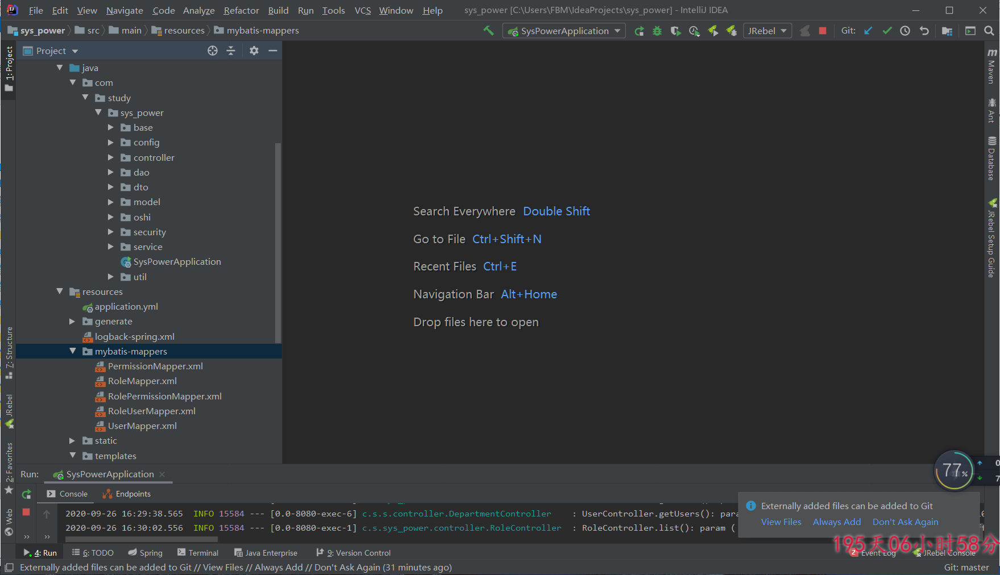
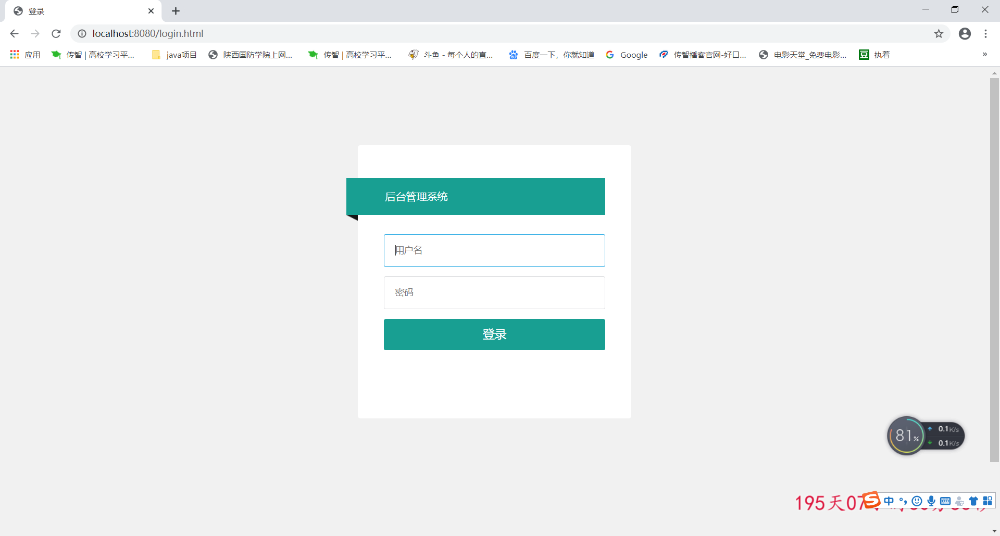

# 权限管理系统 
## 项目介绍
基于java，springboot，html，layui，js等技术编写
供个人或者他人学习用
# 说明： 
本项目是根据哔哩哔哩上一位博主视频编写完成（原视频自行去搜），我在此添加了部门管理（企划部，宣传部，运营部），ecthers销量图（柱状图，饼状图，雷达图，折线图），swagger接口，系统信息等。对系统做了优化，bug等（动态菜单栏添加后不显示等问题）。。
# 本项目我后期会持续更新，如有想要源码的小伙伴可加我qq：632834571。

# 项目图片展示

## 项目架构

## 登录页面

## 主页面

